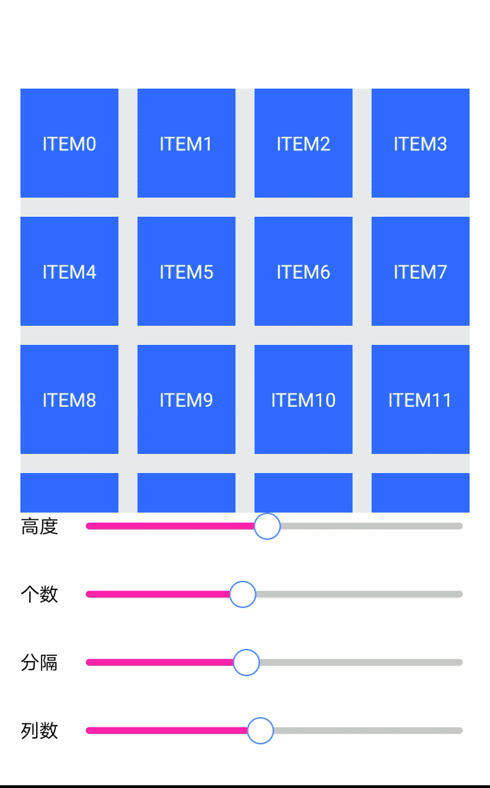

# 一个自定义的N宫格View
--------------------

 

# 用法

	<com.terry.gridlayout.view.GridLayout
		android:id="@+id/gridlayout"
		android:layout_width="match_parent"
		android:layout_height="wrap_content"
		android:layout_margin="15dp"
		android:background="#E7EAEC"
		app:columns="2"
		app:divider_height="3dp">

		<View...>
		<View...>
		<View...>
		<View...>
		<View...>
		<View...>

	</com.terry.gridlayout.view.GridLayout>

# 属性

	columns -> 列数
	divider_height -> 分隔线的高度

# 说明

	 1.item的高度取决于第一个子View的高度；
     2.每个item的宽和高都是相同的。
